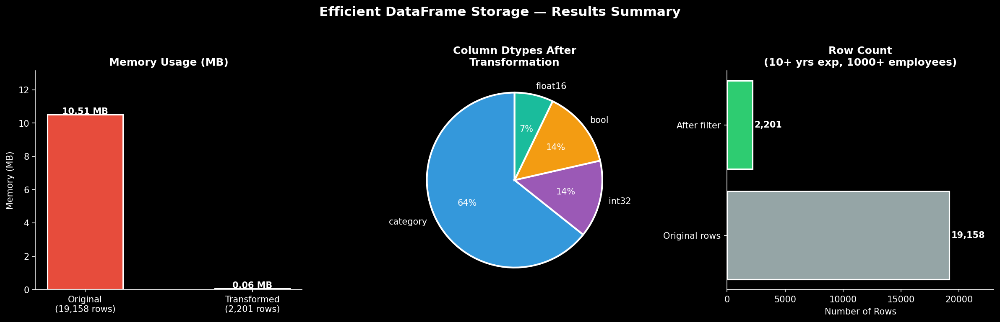

# 🧹 Customer Job-Change Prediction: Efficient DataFrame Storage

   

## Overview
Dtype optimization pipeline for a **19,158-row HR dataset** from Training Data Ltd., reducing memory usage by **99.4%** through correct pandas dtype assignment and enterprise-level filtering.  
The goal is to prepare the dataset for scalable job-change prediction modeling without reducing its size.

*Data source: Training Data Ltd. (modified version via DataCamp)*

## Transformation Pipeline
| Step | Method | Columns Affected | Target Dtype |
|------|--------|-----------------|--------------|
| 1 | `convert_bool()` | `relevant_experience`, `job_change` | `bool` |
| 2 | `convert_num()` | `student_id`, `training_hours`, `city_development_index` | `int32` / `float16` |
| 3 | `convert_nom_cat()` | `city`, `gender`, `major_discipline`, `company_type` | `category` |
| 4 | `convert_ord_cat()` | `enrolled_university`, `education_level`, `experience`, `company_size`, `last_new_job` | ordered `category` |
| 5 | `filter_data()` | Rows | 10+ yrs experience & 1,000+ employee companies only |

## Key Results
- 💾 Memory reduced from **~10.5 MB → ~61 KB** — a **99.4% reduction**
- 📋 Rows filtered from **19,158 → 2,201** (enterprise-ready recruiter target group)
- 🏷️ All 14 columns converted from default `object/int64/float64` to optimal dtypes
- 📦 9 of 14 columns stored as `category` — the biggest driver of memory savings

## Visualizations
| Chart | Insight |
|-------|---------|
| Memory usage (bar) | Before vs. after comparison in MB |
| Dtype distribution (pie) | 9 category, 2 bool, 2 int32, 1 float16 |
| Row count (bar) | 19,158 original vs. 2,201 after filter |



## Tools & Libraries
- **Python 3.13** · **Pandas** · **NumPy** · **Matplotlib**

## Dataset
`customer_train.csv` — 19,158 rows × 14 columns of anonymized student data.  
Source: Training Data Ltd. via [DataCamp](https://www.datacamp.com) guided project on efficient data storage.

## How to Run
```bash
git clone https://github.com/JuniorChai/ds-customer-job-change
cd ds-customer-job-change
pip install pandas numpy matplotlib jupyter
jupyter notebook customer_analytic.ipynb
```

---
*Part of my Data Analytics Portfolio — [github.com/JuniorChai](https://github.com/JuniorChai)*
